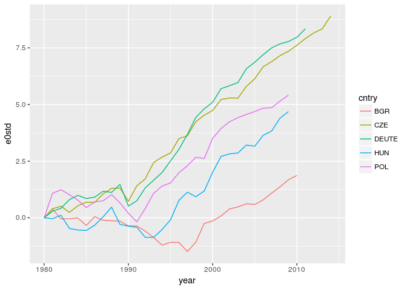
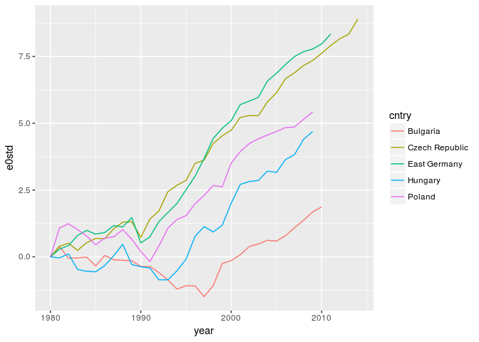
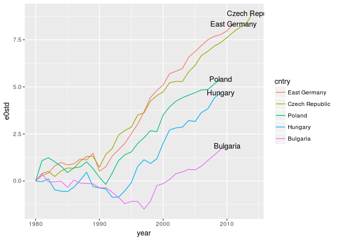
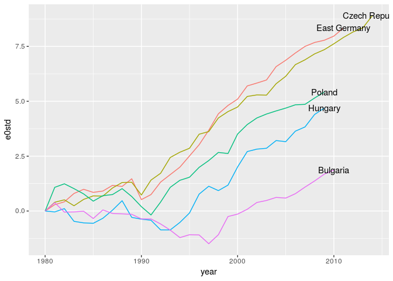
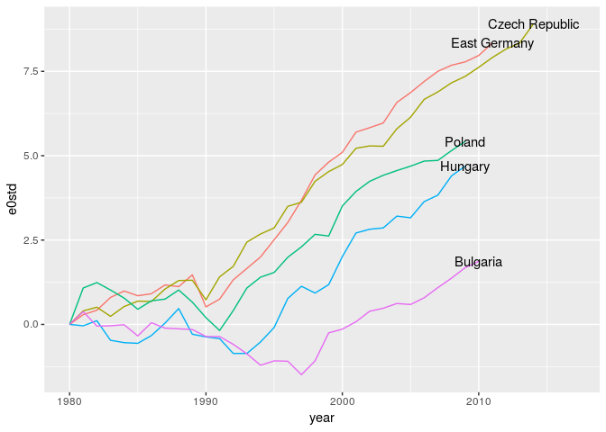
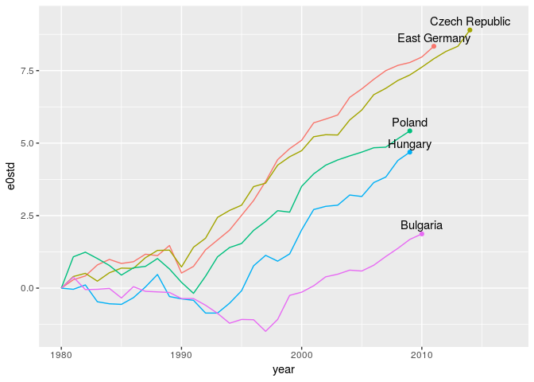
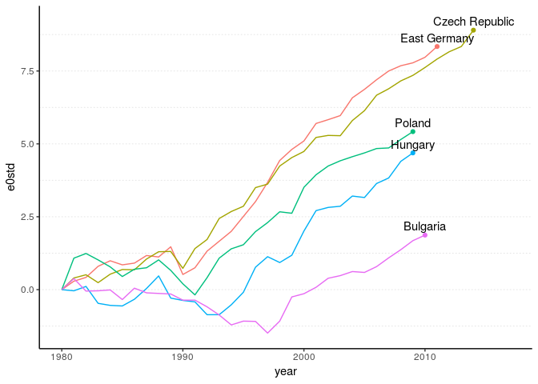
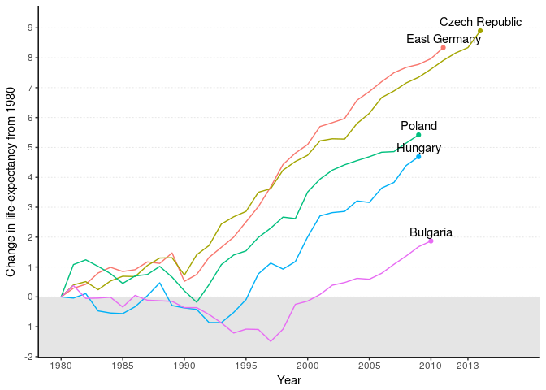
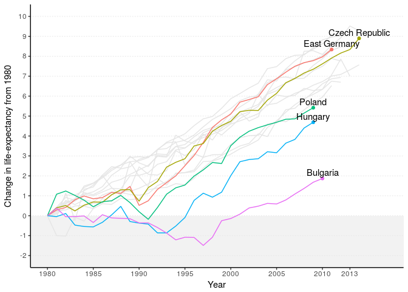
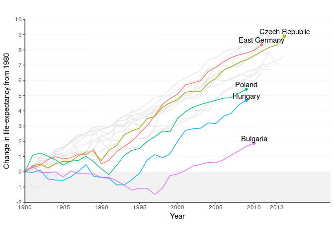

Polishing your plot for publication.
================
Jonas Schöley
February 1st, 2017

-   [Eastern European life-expectancy changes since 1980](#eastern-european-life-expectancy-changes-since-1980)
-   [Spell it out](#spell-it-out)
-   [Use order](#use-order)
-   [Use direct annotation](#use-direct-annotation)
-   [Avoid clutter](#avoid-clutter)
-   [Highlight important features](#highlight-important-features)
-   [Adjust scale breaks](#adjust-scale-breaks)
-   [Show context](#show-context)
-   [Set the aspect ratio](#set-the-aspect-ratio)

Eastern European life-expectancy changes since 1980
---------------------------------------------------

``` r
library(tidyverse)
```

    ## ── Attaching packages ─────────────────── tidyverse 1.2.1 ──

    ## ✔ ggplot2 2.2.1     ✔ purrr   0.2.4
    ## ✔ tibble  1.4.1     ✔ dplyr   0.7.4
    ## ✔ tidyr   0.7.2     ✔ stringr 1.2.0
    ## ✔ readr   1.1.1     ✔ forcats 0.2.0

    ## ── Conflicts ────────────────────── tidyverse_conflicts() ──
    ## ✖ dplyr::filter() masks stats::filter()
    ## ✖ dplyr::lag()    masks stats::lag()

``` r
e0 <-
  read_csv('e0.csv') %>%
  filter(cntry %in% c('BGR', 'CZE', 'HUN', 'POL', 'DEUTE'),
         sex == 'male', year >= 1980) %>%
  group_by(cntry) %>%
  mutate(e0std = e0 - e0[year == 1980]) %>%
  ungroup()
```

    ## Parsed with column specification:
    ## cols(
    ##   cntry = col_character(),
    ##   year = col_integer(),
    ##   sex = col_character(),
    ##   e0 = col_double(),
    ##   edagger = col_double(),
    ##   kentro = col_double()
    ## )

``` r
ggplot(e0, aes(x = year, y = e0std)) +
  geom_line(aes(color = cntry))
```



Spell it out
------------

``` r
e0 <-
  e0 %>%
  mutate(cntry = fct_recode(cntry,
                            'Bulgaria' = 'BGR',
                            'Czech Republic' = 'CZE',
                            'East Germany' = 'DEUTE',
                            'Hungary' = 'HUN',
                            'Poland' = 'POL'))

ggplot(e0, aes(x = year, y = e0std)) +
  geom_line(aes(color = cntry))
```



Use order
---------

``` r
e0 <-
  e0 %>%
  mutate(cntry = fct_relevel(cntry,
                             'East Germany',
                             'Czech Republic',
                             'Poland',
                             'Hungary',
                             'Bulgaria'))

ggplot(e0, aes(x = year, y = e0std)) +
  geom_line(aes(color = cntry))
```


Use direct annotation
---------------------

``` r
cntry_labels <-
  e0 %>%
  group_by(cntry) %>%
  filter(year == max(year)) %>%
  ungroup()

ggplot(e0, aes(x = year, y = e0std)) +
  geom_line(aes(color = cntry)) +
  geom_text(aes(x = year, y = e0std, label = cntry),
            data = cntry_labels)
```



``` r
ggplot(e0, aes(x = year, y = e0std)) +
  geom_line(aes(color = cntry), show.legend = FALSE) +
  geom_text(aes(x = year, y = e0std, label = cntry),
            data = cntry_labels)
```



``` r
ggplot(e0, aes(x = year, y = e0std)) +
  geom_line(aes(color = cntry), show.legend = FALSE) +
  geom_text(aes(x = year, y = e0std, label = cntry),
            data = cntry_labels) +
  scale_x_continuous(limits = c(1980, 2017))
```



``` r
ggplot(e0, aes(x = year, y = e0std)) +
  geom_line(aes(color = cntry), show.legend = FALSE) +
  geom_text(aes(x = year, y = e0std, label = cntry),
            nudge_y = 0.3,
            data = cntry_labels) +
  scale_x_continuous(limits = c(1980, 2017))
```


``` r
ggplot(e0, aes(x = year, y = e0std)) +
  geom_line(aes(color = cntry)) +
  geom_point(data = cntry_labels, aes(color = cntry)) +
  geom_text(aes(x = year, y = e0std, label = cntry),
            nudge_y = 0.3,
            data = cntry_labels) +
  scale_x_continuous(limits = c(1980, 2017)) +
  guides(color = FALSE)
```



Avoid clutter
-------------

``` r
ggplot(e0, aes(x = year, y = e0std)) +
  geom_line(aes(color = cntry)) +
  geom_point(data = cntry_labels, aes(color = cntry)) +
  geom_text(aes(x = year, y = e0std, label = cntry),
            nudge_y = 0.3,
            data = cntry_labels) +
  scale_x_continuous(limits = c(1980, 2017)) +
  guides(color = FALSE) +
  theme_classic()
```


``` r
ggplot(e0, aes(x = year, y = e0std)) +
  geom_line(aes(color = cntry)) +
  geom_point(data = cntry_labels, aes(color = cntry)) +
  geom_text(aes(x = year, y = e0std, label = cntry),nudge_y = 0.3,
            data = cntry_labels) +
  scale_x_continuous(limits = c(1980, 2017)) +
  guides(color = FALSE) +
  theme_classic() +
  theme(panel.grid.major.y =
          element_line(color = 'grey90', linetype = 'dotted'),
        panel.grid.minor.y =
          element_line(color = 'grey90', linetype = 'dotted'))
```



Highlight important features
----------------------------

``` r
ggplot(e0, aes(x = year, y = e0std)) +
  annotate('rect', xmin = -Inf, xmax = Inf, ymin = -Inf, ymax = 0,
           fill = 'grey90') +
  geom_line(aes(color = cntry)) +
  geom_point(data = cntry_labels, aes(color = cntry)) +
  geom_text(aes(x = year, y = e0std, label = cntry),nudge_y = 0.3,
            data = cntry_labels) +
  scale_x_continuous(limits = c(1980, 2017)) +
  guides(color = FALSE) +
  theme_classic() +
  theme(panel.grid.major.y =
          element_line(color = 'grey90', linetype = 'dotted'),
        panel.grid.minor.y =
          element_line(color = 'grey90', linetype = 'dotted'))
```


Adjust scale breaks
-------------------

``` r
ggplot(e0, aes(x = year, y = e0std)) +
  annotate('rect', xmin = -Inf, xmax = Inf, ymin = -Inf, ymax = 0,
           fill = 'grey90') +
  geom_line(aes(color = cntry)) +
  geom_point(data = cntry_labels, aes(color = cntry)) +
  geom_text(aes(x = year, y = e0std, label = cntry),nudge_y = 0.3,
            data = cntry_labels) +
  scale_x_continuous('Year', breaks = c(seq(1980, 2010, 5), 2013),
                     limits = c(1980, 2017)) +
  scale_y_continuous('Change in life-expectancy from 1980',
                     breaks = seq(-2, 10, 1)) +
  guides(color = FALSE) +
  theme_classic() +
  theme(panel.grid.major.y =
          element_line(color = 'grey90', linetype = 'dotted'))
```



Show context
------------

``` r
e0_nato <-
  read_csv('e0.csv') %>%
  filter(cntry %in% c('DEUTW', 'DNK', 'SWE',
                      'ITA', 'ISL', 'GBRTENW', 'ESP',
                      'NLD', 'LUX', 'BEL', 'PRT'),
         sex == 'male') %>%
  group_by(cntry) %>%
  mutate(e0std = e0 - e0[year == 1980])
```

    ## Parsed with column specification:
    ## cols(
    ##   cntry = col_character(),
    ##   year = col_integer(),
    ##   sex = col_character(),
    ##   e0 = col_double(),
    ##   edagger = col_double(),
    ##   kentro = col_double()
    ## )

``` r
ggplot(e0, aes(x = year, y = e0std)) +
  annotate('rect', xmin = -Inf, xmax = Inf, ymin = -Inf, ymax = 0,
           fill = 'grey90', alpha = 0.5) +
  geom_line(aes(group = cntry), color = 'grey90', data = e0_nato) +
  geom_line(aes(color = cntry)) +
  geom_point(data = cntry_labels, aes(color = cntry)) +
  geom_text(aes(x = year, y = e0std, label = cntry),nudge_y = 0.3,
            data = cntry_labels) +
  scale_x_continuous('Year', breaks = c(seq(1980, 2010, 5), 2013),
                     limits = c(1980, 2017)) +
  scale_y_continuous('Change in life-expectancy from 1980',
                     breaks = seq(-2, 10, 1),
                     limits = c(-2, 10)) +
  guides(color = FALSE) +
  theme_classic() +
  theme(panel.grid.major.y =
          element_line(color = 'grey90', linetype = 'dotted'))
```

    ## Warning: Removed 1183 rows containing missing values (geom_path).



Set the aspect ratio
--------------------

``` r
ggplot(e0, aes(x = year, y = e0std)) +
  annotate('rect', xmin = -Inf, xmax = Inf, ymin = -Inf, ymax = 0,
           fill = 'grey90', alpha = 0.5) +
  geom_line(aes(group = cntry), color = 'grey90', data = e0_nato) +
  geom_line(aes(color = cntry)) +
  geom_point(data = cntry_labels, aes(color = cntry)) +
  geom_text(aes(x = year, y = e0std, label = cntry),nudge_y = 0.3,
            data = cntry_labels) +
  scale_x_continuous('Year', breaks = c(seq(1980, 2010, 5), 2013),
                     limits = c(1980, 2020)) +
  scale_y_continuous('Change in life-expectancy from 1980',
                     breaks = seq(-2, 10, 1),
                     limits = c(-2, 10)) +
  guides(color = FALSE) +
  theme_classic() +
  theme(panel.grid.major.y =
          element_line(color = 'grey90', linetype = 'dotted')) +
  coord_fixed(2, expand = FALSE)
```

    ## Warning: Removed 1183 rows containing missing values (geom_path).



``` r
#ggsave(filename = 'pe0.pdf', width = unit(10, 'cm'), height = unit(5, 'cm'))
```
